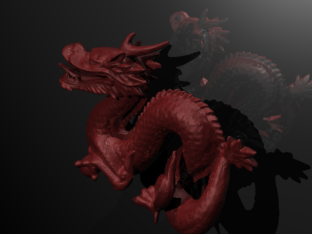

# Java RayTracer Engine


Un moteur de **Ray Tracing** complet développé en **Java pur**. Ce dépôt contient deux projets distincts : le moteur de rendu principal et un outil de validation par comparaison d'images.

---

## Galerie de Rendu

### Scène Finale "Dragon" (Avec Bonus)
> Cette scène complexe (+50k triangles) démontre la puissance de l'optimisation **BVH**, la gestion des **ombres portées**, des **matériaux complexes** et de la **réflexion miroir**.



&


*(L'image est générée dans le dossier `output/` après exécution du moteur)*

---

## Architecture du Projet

Le projet est divisé en deux modules Maven indépendants :

1.  **`raytracer`** : Le moteur de rendu 3D.
2.  **`imgcompare`** : L'outil de validation (tests de non-régression).

### Module RayTracer
Ce moteur implémente les fonctionnalités suivantes :
* **Géométrie** : Sphères, Plans, Triangles.
* **Performance** : Accélération spatiale BVH (AABB) et Multi-threading.
* **Éclairage** : Modèle de Blinn-Phong, Ombres portées, Réflexion récursive.
* **Parsing** : Lecteur de scènes `.scene` robuste.

### Module ImgCompare
Un utilitaire permettant de :
* Comparer deux images pixel par pixel.
* Générer une image différentielle (Heatmap des erreurs).
* Valider automatiquement les rendus par rapport aux références.

---

## Structure des Dossiers

```text
ProjetRayTracer/
├── imgcompare/           # [Projet Maven] Outil de comparaison
│   ├── src/main/java/...
│   └── pom.xml
├── raytracer/            # [Projet Maven] Moteur de rendu
│   ├── src/main/java/...
│   └── pom.xml
├── scenes/               # Fichiers de description de scènes (.scene)
├── images_test/          # Images de référence pour les tests
└── output/               # Dossier de sortie des rendus
```

## Installation et compilation

Prérequis : **Java JDK 21** et **Maven 3.6+**.

Chaque module doit être compilé séparément.

### 1. Compilation du Comparateur

```bash
cd imgcompare
mvn clean package
cd ..
```

### 2. Compilation du Raytracer

```bash
cd raytracer
mvn clean package
cd ..
```

## Exécution

Toutes les commandes s'exécutent depuis la racine du projet (`ProjetRayTracer/`).

### Lancer un rendu

Pour générer une image à partir d'un fichier de scène :

```bash
java -jar raytracer/target/raytracer-1.0-SNAPSHOT.jar scenes/final_avec_bonus.scene
```

Le résultat sera sauvegardé dans le dossier `output/`.

### Lancer une comparaison

Pour vérifier un rendu par rapport à une image de référence :

```bash
java -jar imgcompare/target/imgcompare-1.0-SNAPSHOT.jar output/mon_image.png scenes/reference.png
```

## Tests unitaires

Pour lancer les tests unitaires du moteur mathématique (Vecteurs, Points, Couleurs) :

```bash
cd raytracer
mvn test
```

## Auteur

Projet réalisé dans le cadre du cours de **Conception et Programmation Orientée Objet** à l'IMT Nord Europe.

Date : Décembre 2025
Rémy MAZINGUE.